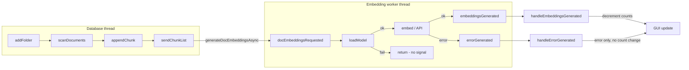

# Fix LocalDocs embeddings stuck at 0%

## Root cause

Two issues explain the behavior you see (folder indexes to 20 files / 695k words, then "Embedding in progress 0%" or "Updating" never advances):

1. **Silent failure in embedding worker**
  In [gpt4all-chat/src/embllm.cpp](gpt4all-chat/src/embllm.cpp), `EmbeddingLLMWorker::docEmbeddingsRequested()` calls `loadModel()` on first use. If `loadModel()` fails (e.g. local embedding model file not found at `../Resources/nomic-embed-text-v1.5.f16.gguf`, wrong device, or model doesn’t support embeddings), the function **returns without emitting any signal**:

```252:258:gpt4all-chat/src/embllm.cpp
        if (!hasModel() && !loadModel()) {
            qWarning() << "WARNING: Could not load model for embeddings";
            return;  // no errorGenerated() emitted
        }
```

   So the database never receives `embeddingsGenerated` or `errorGenerated`, and `currentEmbeddingsToIndex` never decreases. The UI keeps showing "Embedding in progress" / "Updating" at 0%.

1. **Errors don’t update progress counts**
  In [gpt4all-chat/src/database.cpp](gpt4all-chat/src/database.cpp), `handleErrorGenerated()` only sets `item.error` and refreshes the GUI. It **does not** decrement `currentEmbeddingsToIndex` (or adjust `totalEmbeddingsToIndex`) for the failed chunks. So even when the worker does emit `errorGenerated` (e.g. Nomic API error), the collection stays in the "Updating" state because the counts never go down.

## Flow (relevant parts)




## Proposed changes

### 1. Emit `errorGenerated` when the embedding model fails to load

**File:** [gpt4all-chat/src/embllm.cpp](gpt4all-chat/src/embllm.cpp)

- In `docEmbeddingsRequested()`, when `!hasModel() && !loadModel()`:
  - Emit `errorGenerated(chunks, "<message>")` with a clear message (e.g. that the embedding model could not be loaded and to check installation and LocalDocs settings such as device).
- Optionally include a hint about the expected path (e.g. app `../Resources` or `../resources`) so support/debugging is easier.

This ensures the UI and database are informed when embedding cannot run, instead of failing silently.

### 2. Decrement embedding counts in `handleErrorGenerated`

**File:** [gpt4all-chat/src/database.cpp](gpt4all-chat/src/database.cpp)

- In `handleErrorGenerated()`:
  - For each `folder_id` present in the failed `chunks`, compute how many chunks failed for that folder.
  - For the corresponding `CollectionItem`, subtract that count from `currentEmbeddingsToIndex` (and, if desired for consistency, from `totalEmbeddingsToIndex`), with underflow guards similar to `handleEmbeddingsGenerated()`.
  - If after the update `!item.indexing && item.currentEmbeddingsToIndex == 0`, call `setLastUpdateTime(item)` so the collection is no longer considered "in progress."
  - Keep the existing behavior of setting `item.error` and calling `updateGuiForCollectionItem(item)`.

This way, when any batch fails (load error or API error), the progress state and counts reflect that those chunks are “done” (with error), and the UI can leave "Updating" and show the error instead of staying stuck at 0%.

### 3. (Optional) Proactive embedding-model check

- Consider triggering an embedding-model load (or a lightweight “can load” check) when the user opens LocalDocs or adds a collection, and surfacing “Embedding model not available” before they wait for indexing. This can be a follow-up so the first two fixes unblock the stuck state immediately.

## Files to touch


| File                                                           | Change                                                                                                                                                                                                         |
| -------------------------------------------------------------- | -------------------------------------------------------------------------------------------------------------------------------------------------------------------------------------------------------------- |
| [gpt4all-chat/src/embllm.cpp](gpt4all-chat/src/embllm.cpp)     | On load failure in `docEmbeddingsRequested`, emit `errorGenerated(chunks, message)` instead of returning.                                                                                                      |
| [gpt4all-chat/src/database.cpp](gpt4all-chat/src/database.cpp) | In `handleErrorGenerated`, decrement `currentEmbeddingsToIndex` (and optionally `totalEmbeddingsToIndex`) per folder for the failed chunks, with underflow protection and `setLastUpdateTime` when fully done. |


## Verification

- Add a collection with a folder; if the embedding model is missing or misconfigured, the UI should show an error and the collection should no longer show "Embedding in progress 0%" or "Updating" indefinitely.
- If the worker emits `errorGenerated` (e.g. Nomic API error), the same behavior: error visible and progress counts updated so "Updating" can clear.

